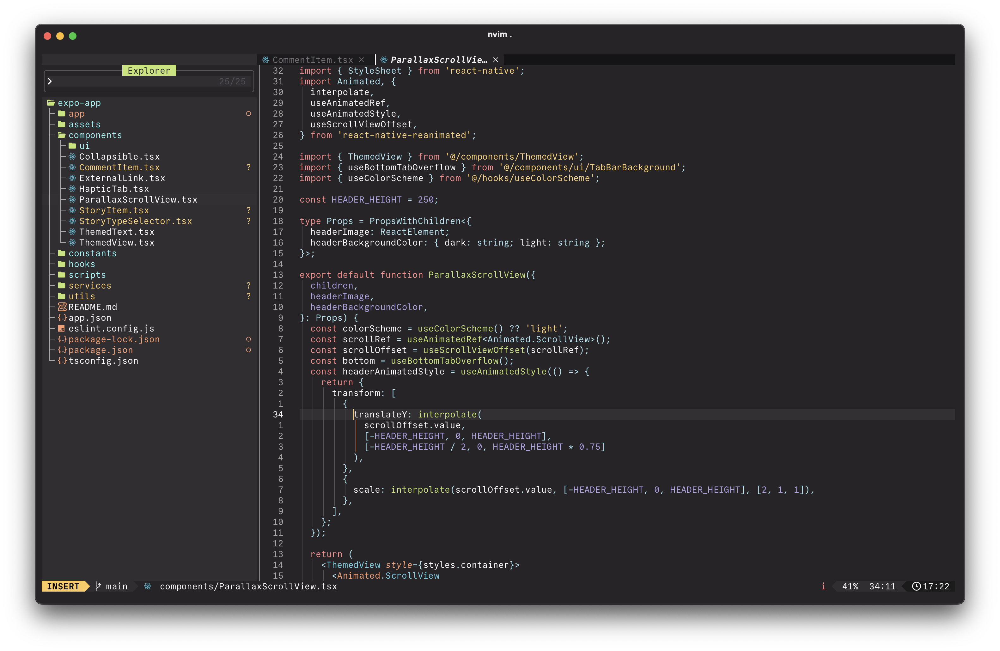

# 0x96f.nvim

A simple and pleasant dark theme for Neovim.

## Screenshots



## Installation

### Quick Install (Recommended)

Use the automated install script:

```bash
curl -fsSL https://raw.githubusercontent.com/filipjanevski/0x96f.nvim/main/install.sh | bash
```

Or download and run manually:

```bash
wget https://raw.githubusercontent.com/filipjanevski/0x96f.nvim/main/install.sh
chmod +x install.sh
./install.sh
```

The script will:

- Auto-detect your plugin manager (lazy.nvim, packer.nvim, vim-plug)
- Create appropriate configuration files
- Backup existing configurations
- Provide setup instructions

#### Install Script Options

```bash
./install.sh [OPTIONS]

OPTIONS:
    -d, --dir DIR           Neovim configuration directory (default: ~/.config/nvim)
    -m, --manager MANAGER   Plugin manager (lazy, packer, plug)
    -f, --force            Force installation (overwrite existing files)
    -h, --help             Show help message

EXAMPLES:
    ./install.sh                                    # Auto-detect setup
    ./install.sh -m lazy                           # Install for lazy.nvim
    ./install.sh -d ~/.config/nvim-custom          # Custom config directory
    ./install.sh -m packer -f                     # Force install for packer.nvim
```

### Manual Installation

### Using [lazy.nvim](https://github.com/folke/lazy.nvim)

```lua
{
  "filipjanevski/0x96f.nvim",
  priority = 1000,
  config = function()
    require("0x96f").setup()
    vim.cmd.colorscheme("0x96f")
  end,
}
```

### Using [packer.nvim](https://github.com/wbthomason/packer.nvim)

```lua
use {
  "filipjanevski/0x96f.nvim",
  config = function()
    require("0x96f").setup()
    vim.cmd.colorscheme("0x96f")
  end
}
```

### Using vim-plug

```vim
Plug 'filipjanevski/0x96f.nvim'
```

Then in your init.lua:

```lua
require("0x96f").setup()
vim.cmd.colorscheme("0x96f")
```

## Usage

### Basic setup

```lua
require("0x96f").setup()
vim.cmd.colorscheme("0x96f")
```

### Traditional vim command

```vim
colorscheme 0x96f
```

### Accessing colors

```lua
local colors = require("0x96f").colors
-- Use colors.blue, colors.green, etc. in your custom highlights
```

### Lualine Integration

This theme includes a custom lualine theme for better integration. To use it:

```lua
require('lualine').setup {
  options = {
    theme = '0x96f'
  },
  -- your other lualine config...
}
```

Or if you're setting up the theme programmatically:

```lua
require("0x96f").setup()
require('lualine').setup {
  options = {
    theme = require("0x96f").get_lualine_theme()
  },
  -- your other lualine config...
}
```

The lualine theme includes:

- Mode-specific colors (normal, insert, visual, replace, command)
- Proper color transitions between sections
- Consistent styling with the overall theme
- Support for inactive windows

## License

MIT License - see [LICENSE](LICENSE) for details.
